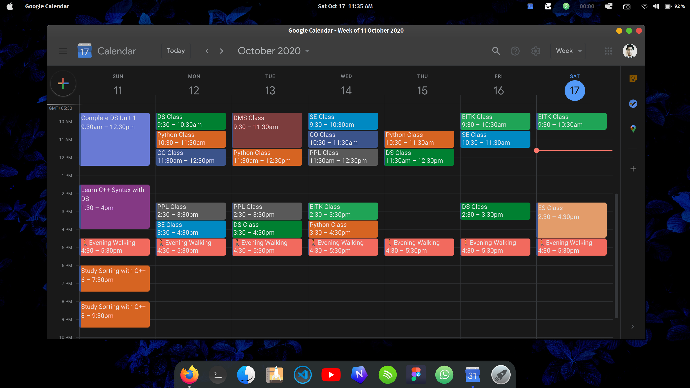
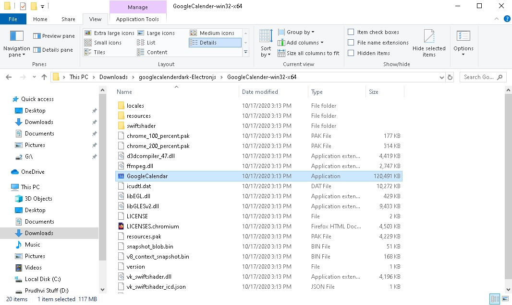

# Google Calender Dark for Linux, Mac and Windows 🔥🔥🔥
This app is a electron wraper for Google Calender (https://calendar.google.com/).

<center>

</center>
<!-- Add icon library -->
<link rel="stylesheet" href="https://cdnjs.cloudflare.com/ajax/libs/font-awesome/4.7.0/css/font-awesome.min.css">

## For Windows :
1. **Clone this repo (or you can download the zip of this repo) :**
```
$ git clone https://github.com/Royal-lobster/googlecalenderdark-Electronjs.git
```
2. **To run the application :**
Go inside the googlecalenderdark-Electronjs folder you just cloned or downloded, Go inside the GoogleCalender-win32-x64 folder and double click on the GoogleCalendar.exe

<p align="center">

</p>

## For Linux :
1. **Clone this repo :**
```
$ git clone https://github.com/Royal-lobster/googlecalenderdark-Electronjs.git
$ cd googlecalenderdark-Electronjs
```
2. **Go to linux app folder:**
```
$ cd GoogleCalendar-linux-x64
```
3. **run the application :**
```
$ ./GoogleCalendar
```
* you can remove the windows and mac folders once the repo is cloned.
* you can add the app to dock and launcher by using mainmenu app which you can download from your software center.

## For Mac os :
<a href="https://github.com/Royal-lobster/googlecalenderdark-Electronjs/raw/master/Google%20Calender-mac-x64/Google%20Calender.app/Contents/MacOS/Google%20Calender"> Download osx file for Mac OS</a>
### License :
```
Copyright 2020 Srujan Gurram

Licensed under the Apache License, Version 2.0 (the "License");
you may not use this file except in compliance with the License.
You may obtain a copy of the License at

    http://www.apache.org/licenses/LICENSE-2.0

Unless required by applicable law or agreed to in writing, software
distributed under the License is distributed on an "AS IS" BASIS,
WITHOUT WARRANTIES OR CONDITIONS OF ANY KIND, either express or implied.
See the License for the specific language governing permissions and
limitations under the License.
```
> :information_source: You can customize the CSS file at (resources < app < inject < inject.css)

**Credits** : Thanks **@cardi** for CSS file : https://github.com/cardi/google-calendar-minimal-dark
